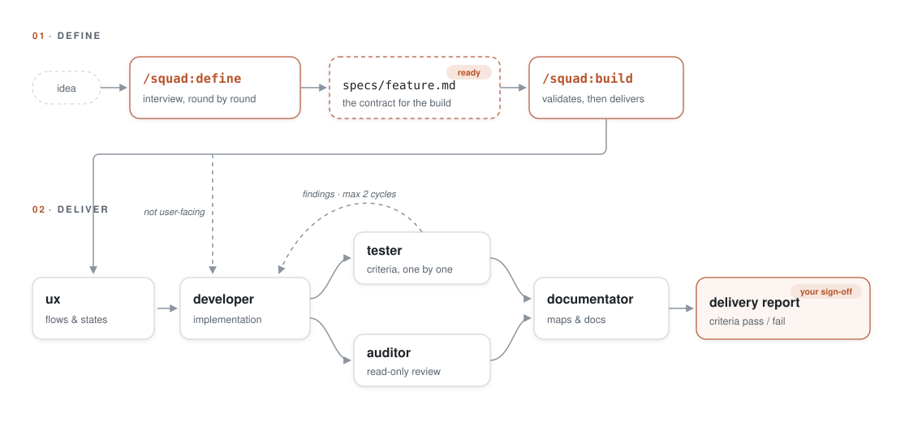

# Build Squad

> A five-role engineering squad for Claude Code and Codex: UX, Developer, Tester, Auditor, and Documentator work through disciplined definition, build, fix, refactor, and review pipelines.

[](LICENSE)
[](https://code.claude.com/docs/en/plugins)
[](https://developers.openai.com/codex)

## Why

A single agent implementing, testing, reviewing, and documenting its own work loses useful separation of concerns. Build Squad preserves that separation: the main session defines the product with you; specialized roles deliver, test, audit, and document against a written contract.

The source repository ships two first-class adapters:

- **Claude Code** uses the established `squad` plugin, Markdown subagents, and its guard hook.
- **Codex** uses the versioned [`plugins/build-squad`](plugins/build-squad) package, eight Codex skills, five installable TOML agents, and a Codex-format guard hook.

They share the same engineering rules but do not share runtime-specific configuration files. That keeps one repository distributable through both plugin ecosystems without relying on fragile symlinks or loader-specific behavior.

## Features

- **Define** — conversational specification with verifiable acceptance criteria and explicit excluded scope.
- **Build** — a gated delivery choreography: UX (when relevant) → developer → tester ∥ auditor → documentation.
- **Fix** — reproduce-first: a red regression test is the default gate before production code changes.
- **Refactor** — freezes baseline test results as the behavior invariant.
- **Review** — a strictly read-only, severity-ranked verdict on a diff, branch, or PR.
- **Five focused roles** — developer, tester, UX, auditor, and documentation responsibilities remain separate.
- **Reusable playbooks** — semantic architecture, breaking-contract transitions, and smallest-sufficient validation.
- **Safety guard** — blocks `kubectl` and destructive Git operations at the tool-call layer.

## How it works

<picture>
  <source media="(prefers-color-scheme: dark)" srcset="docs/pipeline-dark.svg">
  
</picture>

Definition is a conversation; delivery is a pipeline. A closed spec at `specs/<slug>.md` is resumable, reviewable, and the tester's contract. If delivery shows that the definition is incomplete, the pipeline stops and returns to definition instead of improvising scope.

## Install for Claude Code

```sh
claude plugin marketplace add sturlese/build-squad
claude plugin install squad@build-squad
```

From a clone:

```sh
git clone https://github.com/sturlese/build-squad.git
claude plugin marketplace add ./build-squad
claude plugin install squad@build-squad
```

## Install for Codex

Codex reads the repository-local marketplace and installs the package it references:

```sh
codex plugin marketplace add sturlese/build-squad
codex plugin add build-squad@build-squad
```

The role profiles are deliberately separate from the plugin loader because Codex discovers custom agents in `~/.codex/agents/`. Install them once from a local clone:

```sh
python3 plugins/build-squad/scripts/install_agents.py
```

Start a new Codex thread after installation or updates. The plugin skills are `$build-squad:squad-define`, `$build-squad:squad-build`, `$build-squad:squad-fix`, `$build-squad:squad-refactor`, `$build-squad:squad-review`, `$build-squad:squad-semantic-architecture`, `$build-squad:squad-breaking-change`, and `$build-squad:squad-final-validation`; delegate roles as `build-squad-developer`, `build-squad-tester`, `build-squad-auditor`, `build-squad-ux`, and `build-squad-documentator`.

## Usage

In Claude Code, invoke the `squad` commands:

```text
/squad:define let users archive products they no longer sell
/squad:build specs/archive-products.md
/squad:fix the CSV export drops rows containing commas
/squad:refactor extract the pricing logic scattered across checkout
/squad:review feature/csv-export
```

In Codex, invoke the matching skill naturally or by name:

```text
Use $build-squad:squad-define to define archiving products.
Use $build-squad:squad-build with specs/archive-products.md.
Use $build-squad:squad-review for the current branch.
```

The team may converse in your language; code, documentation, findings, reports, and commit messages are English.

## Roles

| Role | Responsibility | Boundary |
|---|---|---|
| UX | User flow, copy, states, and accessibility | Documentation and recommendations only. |
| Developer | Bounded implementation, reuse, compatibility, validation | Does not silently expand a closed spec. |
| Tester | Contract protection and regression tests | Never edits production code. |
| Auditor | Security and architecture review | Read-only; returns fix instructions. |
| Documentator | System maps, READMEs, and module indexes | Documentation only; no builds/tests/lint. |

## Security policy

The Claude and Codex adapters each include a tested `PreToolUse` guard. It blocks direct `kubectl`/cluster access and Git commands that discard uncommitted or shared work: `git reset --hard`, `git clean -f`, destructive `git checkout`/`git restore`, `git stash clear`/`drop`, and unsafe `git push --force`. `--force-with-lease` remains permitted.

This is a guardrail for a cooperative agent, not a sandbox against deliberate obfuscation. Prompt-injection handling, secret redaction, and no-production-access rules remain explicit role instructions. See [`hooks/test_guard.py`](hooks/test_guard.py) and [`plugins/build-squad/hooks/test_guard.py`](plugins/build-squad/hooks/test_guard.py) for the pinned contract.

## Project conventions

Roles use `AGENTS.md` (Codex), `CLAUDE.md` (Claude Code), README files, architecture docs, documented overview commands, and per-directory `index.md` maps when present. Nothing beyond a repository's existing context is mandatory; the documentator can bootstrap useful system maps.

## Updating and contributing

Claude Code changes remain under `agents/`, `skills/`, and `hooks/`. Codex changes live under `plugins/build-squad/`; validate both adapters before a PR:

```sh
python3 -m py_compile hooks/guard.py plugins/build-squad/hooks/guard.py
python3 hooks/test_guard.py
python3 plugins/build-squad/hooks/test_guard.py
python3 scripts/validate_plugin.py
python3 plugins/build-squad/scripts/validate.py
```

The Codex package is distributed through `.agents/plugins/marketplace.json`; its source remains entirely in this repository. See [`plugins/build-squad/README.md`](plugins/build-squad/README.md) for the package-local setup.

## License

[MIT](LICENSE)
